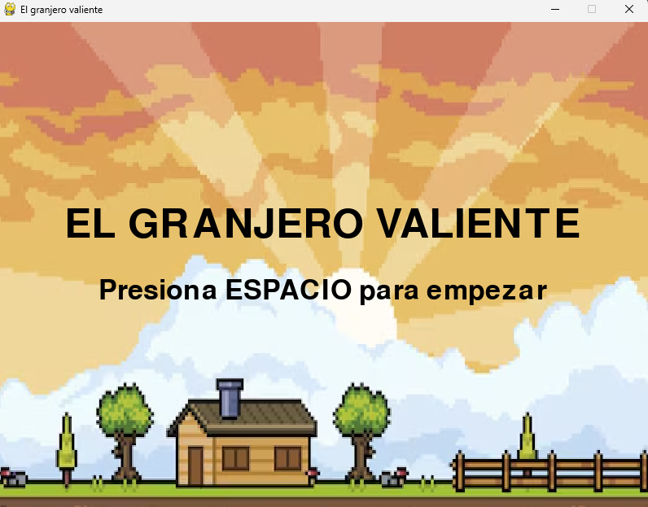

# El Granjero Valiente 🌾

**Un juego simple creado con Python y Pygame.**

*Autor: Jean Pierre*
*Fecha: Junio/2025*
*Contexto: Trabajo práctico para tutor*

## Descripción del Proyecto

"El Granjero Valiente" es un juego arcade en 2D donde el jugador controla a un granjero que debe evitar ser pícado por plagas, en este caso unos escarabajos que van cayendo del cielo. El objetivo es sobrevivir el mayor tiempo posible y acumular puntos. Se gana puntos cada vez que cruza la pantalla de izquierda a derecha sin ser picado. A medida que el jugador acumula puntos, la dificultad aumenta con la aparición de más plagas.

## Funcionalidades

*   **Movimiento del jugador:** El granjero puede moverse horizontalmente (izquierda y derecha) usando las teclas de flecha.
*   **Animación del jugador:** El granjero se voltea para indicar la dirección del movimiento.
*   **Enemigos:** Los escarabajos caen desde la parte superior de la pantalla a velocidades aleatorias.
*   **Sistema de puntuación:**
    *   Se ganan 10 puntos cada vez que el granjero cruza la pantalla de izquierda a derecha.
    *   El puntaje se muestra en la esquina superior izquierda.
*   **Aumento de dificultad:** Cada 50 puntos, aparece una nueva plaga, hasta un máximo de 10 plagas en pantalla.
*   **Colisiones:**
    *   Se utiliza detección de colisión por máscaras (pixel-perfect) entre el granjero y las plagas para mayor precisión.
    *   Si una máscara no se carga correctamente, el juego recurre a colisión por rectángulos.
*   **Menú de inicio:** Una pantalla de inicio simple con el título del juego e instrucciones para comenzar.
*   **Game Over:** Si el granjero es picado por una plaga, aparece un mensaje de "GAME OVER" con la opción de reiniciar.
*   **Reinicio del Juego:** El jugador puede reiniciar la partida presionando la tecla 'R'
*   **Fondo:** El juego utiliza imágenes personalizadas para el fondo, el granjero y las plagas. Si alguna imagen no se carga, se utilizan gráficos de reemplazo.

## Cómo Jugar

1.  **Inicio:** Al ejecutar el juego, aparecerá el menú de inicio.
    *   Presiona la tecla **ESPACIO** para comenzar a jugar.
2.  **Controles:**
    *   **Flecha Izquierda:** Mover al granjero hacia la izquierda.
    *   **Flecha Derecha:** Mover al granjero hacia la derecha.
3.  **Objetivo:**
    *   Evita que las plagas te piquen.
    *   Cruza la pantalla de un lado a otro para ganar puntos.
4.  **Game Over:**
    *   Si una plaga te pica, el juego termina.
    *   Presiona la tecla **R** para reiniciar la partida.

## Estructura del Proyecto

*   `main.py`: El script principal del juego que contiene toda la lógica.
*   `assets/`: Carpeta que contiene todos los recursos gráficos del juego:
    *   `granero.png`: Imagen de fondo.
    *   `granjero.png`: Personaje principal.
    *   `scarab.png`: La plaga.

## Configuración del Entorno y Requisitos

Se recomienda utilizar un entorno virtual para manejar las dependencias del proyecto de forma aislada.

1.  **Python 3.x:** Asegúrate de tener Python 3 instalado. Se puede descargar desde [python.org](https://www.python.org/).
2.  **Crear un entorno virtual:**
    Navegar hasta la carpeta raíz del proyecto en la terminal y ejecutar:
    `python -m venv juego_entorno`

    (Esto creará una carpeta llamada `juego_entorno` que contendrá el entorno virtual. Se puede elegir otro nombre).

3.  **Activar el entorno virtual:**
       **En Windows (CMD/PowerShell):**
        `\juego_entorno\Scripts\activate`
       **En macOS/Linux (bash/zsh):**
        `source venv_granjero/bin/activate`

    Una vez activado, se debería de ver el nombre del entorno `(juego_entorno)` en la terminal.

4.  **Instalar Pygame:**
    Con el entorno virtual activado, instalar Pygame usando:
    `pip install pygame`

## Ejecución

1.  Asegurarse de que el entorno virtual `(juego_entorno)` esté **activado** (ver paso 3).
2.  Navegar hasta el directorio raíz del proyecto (donde se encuentra `main.py`).
3.  Ejecutar el script de Python:
    `python main.py`

## Desactivar el entorno virtual (Opcional)

Cuando se haya terminado de trabajar en el proyecto, se puede desactivar el entorno virtual escribiendo en la terminal:
`deactivate`
